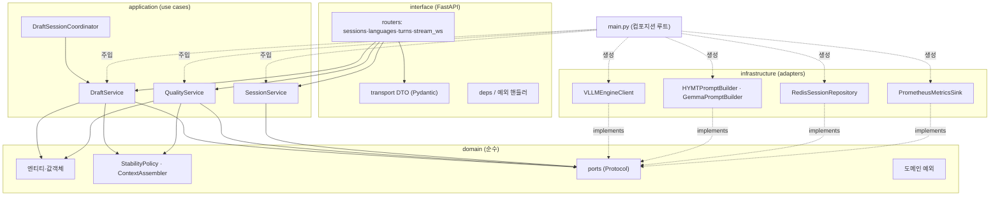
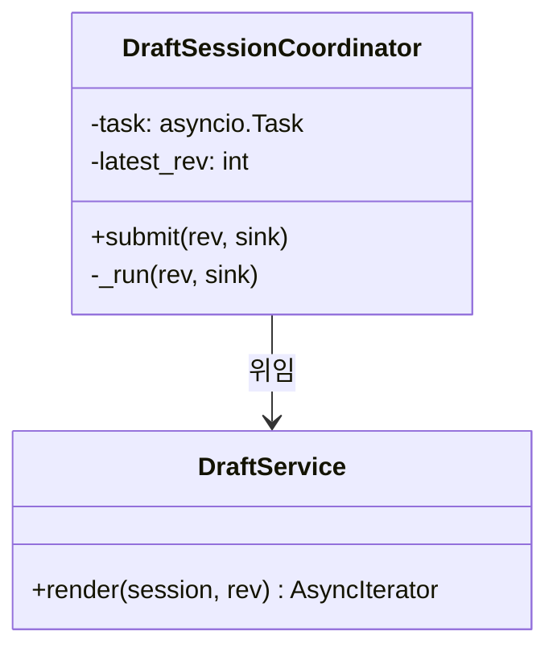

# 백엔드 아키텍처 (gateway)

게이트웨이(FastAPI)의 내부 구조를 소프트웨어 설계 관점에서 정의한다. 기능 요구는
[`design.md`](design.md)에 있고 이 문서는 **그 요구를 어떤 레이어·추상·의존성으로
구현하는가**를 다룬다. 이 문서가 `app/` 패키지 구조의 기준이며 design.md §1·§6의
개략 구조를 대체한다.

## 0. 설계 목표

- **교체 가능성**: 모델(draft/quality)·엔진·저장소를 코드 수정 없이 갈아끼운다.
  두 tier가 OpenAI 호환 뒤에 있고(design.md), 모델은 언제든 바뀐다는 전제(D6)에서
  나온 제약이다.
- **테스트 가능성**: 네트워크(vLLM)·Redis 없이 도메인 로직을 단위 테스트한다.
- **인수인계 가능성**: 표준 레이어 구조라 처음 여는 사람이 흐름을 읽을 수 있다.

## 1. 레이어와 의존성 규칙

Ports & Adapters(헥사고날). **의존성은 항상 안쪽(도메인)을 향한다.** 도메인은
FastAPI·httpx·redis를 import하지 않는다.



핵심: application·domain은 `infrastructure`를 **이름으로도 모른다.** 구현체는
컴포지션 루트(`main.py`)에서만 조립해 주입한다(DIP).

## 2. 패키지 구조

```
app/
├── config.py                 # Settings (pydantic-settings) — env 바인딩
├── main.py                   # app 팩토리 + lifespan = 컴포지션 루트
├── domain/                   # 순수. 바깥 import 금지
│   ├── models.py             # Session, Turn, Revision, Rendering, SessionConfig …
│   ├── languages.py          # LanguageCatalog, LanguagePair
│   ├── stability.py          # StabilityPolicy (디바운스/커밋 판단, 순수 함수)
│   ├── context.py            # ContextAssembler (TMC 컨텍스트 조립, 순수)
│   ├── errors.py             # DomainError 계층
│   └── ports.py              # Protocol: TranslationEngine·SessionRepository·PromptBuilder·MetricsSink·Clock
├── application/
│   ├── draft_service.py      # 초벌 다중타겟 렌더 유스케이스
│   ├── quality_service.py    # 최종 번역 + degradation
│   ├── session_service.py    # 세션 생성/조회 + 워밍업
│   ├── language_service.py   # 지원 언어/검증쌍
│   └── coordinator.py        # DraftSessionCoordinator (single-flight)
├── infrastructure/
│   ├── engines/
│   │   ├── openai_engine.py  # VLLMEngineClient (TranslationEngine 구현)
│   │   └── registry.py       # ModelRegistry: served-name → EngineBinding
│   ├── prompts/
│   │   ├── hy_mt.py          # HYMTPromptBuilder (언어쌍 분기 — Strategy)
│   │   └── gemma.py          # GemmaPromptBuilder
│   ├── persistence/
│   │   └── redis_repo.py     # RedisSessionRepository
│   └── observability/
│       └── metrics.py        # PrometheusMetricsSink
└── interface/http/
    ├── sessions.py, languages.py, turns.py   # REST/SSE 라우터
    ├── stream_ws.py          # WebSocket 초벌
    ├── dto.py                # 요청/응답 DTO (Pydantic) — 도메인과 분리
    ├── mappers.py            # DTO ↔ 도메인 변환
    ├── deps.py               # DI 프로바이더
    └── errors.py             # 예외 → HTTP 매핑
```

## 3. 도메인 모델

엔티티·값객체는 pydantic v2 모델로 두되(검증은 Max 표준), **transport·저장 관심사를
넣지 않는다.** 와이어 포맷은 `interface/http/dto.py`가 따로 갖고 mapper로 변환한다.
이유: 응답에 실리는 `latency_ms`·`committed_prefix_len`은 전송 관심사지 도메인 사실이
아니다. 도메인이 wire를 따라 흔들리지 않게 경계를 둔다.

```python
# domain/models.py  (발췌)
class Rendering(BaseModel):          # 한 타겟 언어의 번역 결과 (값객체)
    lang: str
    text: str
    committed_prefix_len: int = 0

class Revision(BaseModel):           # 초벌 입력 한 건 (값객체)
    id: int
    partial_text: str
    is_final: bool

class Turn(BaseModel):               # 확정 문장 한 턴 (엔티티)
    turn_id: int
    source: str
    draft: dict[str, str]
    final: str | None = None

class Session(BaseModel):            # 애그리거트 루트
    id: str
    config: SessionConfig
    def target_langs(self) -> list[str]:      # tgt + witness, 중복 제거
        ...
```

- **애그리거트 경계**: `Session`이 루트. `Turn`은 세션을 통해서만 추가된다
  (`SessionRepository.append_turn`). 대화 이력 일관성을 한 곳에서 강제.
- 순수 로직은 도메인 서비스로 분리해 단위 테스트한다:
  - `StabilityPolicy.should_commit(pair) -> bool` — 어순 유사 쌍만 접두어 커밋(D3).
  - `ContextAssembler.build(turns, config, budget) -> Conversation` — 직전 N턴
    이중언어 컨텍스트 + 토큰 예산 절단(design.md §5.1). I/O 없음.

## 4. 포트 (Protocol)

application·domain이 의존하는 인터페이스. 좁게 나눈다(ISP) — 한 어댑터에 필요 이상을
강요하지 않는다.

```python
# domain/ports.py
class TranslationEngine(Protocol):
    def stream(self, req: EngineRequest) -> AsyncIterator[TokenChunk]: ...
    async def health(self) -> EngineHealth: ...

class PromptBuilder(Protocol):                       # Strategy
    def build(self, task: TranslationTask) -> list[ChatMessage]: ...
    def build_contextual(self, task: TranslationTask,
                         ctx: Conversation) -> list[ChatMessage]: ...

class SessionRepository(Protocol):                   # Repository
    async def create(self, cfg: SessionConfig) -> Session: ...
    async def get(self, sid: str) -> Session | None: ...
    async def append_turn(self, sid: str, turn: Turn) -> None: ...
    async def recent_turns(self, sid: str, n: int) -> list[Turn]: ...

class MetricsSink(Protocol):
    def observe_latency(self, tier: str, ttft_ms: float, total_ms: float) -> None: ...
    def incr(self, counter: str) -> None: ...

class Clock(Protocol):
    def now_ms(self) -> float: ...                    # 테스트에서 가짜 시계 주입
```

`stream`은 `async def`가 아니라 `AsyncIterator` 반환 시그니처로 둬서 취소 시 제너레이터
close가 업스트림 httpx 스트림을 닫고 → vLLM 생성을 abort하게 한다(design.md §7).

## 5. 어댑터 (infrastructure)

포트를 구현한다. 여기서만 httpx·redis·prometheus를 import한다.

- **`VLLMEngineClient(TranslationEngine)`** — OpenAI 호환 `/chat/completions`
  스트리밍을 `TokenChunk`로 변환하는 **Adapter**. tier별 base_url을 주입받는다.
  엔진 실패는 `UpstreamEngineError`로 감싼다(도메인 예외와 구분).
- **`ModelRegistry`** — `served-model-name → EngineBinding(engine, prompt_builder,
  tier)` 해석. draft·quality 두 바인딩을 컴포지션 루트에서 등록. 모델 교체 =
  등록 변경뿐(OCP).
- **`HYMTPromptBuilder` / `GemmaPromptBuilder`(PromptBuilder)** — 프롬프트 규약이
  모델 계열마다 다르다(HY-MT는 언어쌍별 분기 — 중문/영문 지시, D0). 계열 추가 시
  Strategy 하나 추가로 끝. 서비스 코드는 불변.
- **`RedisSessionRepository(SessionRepository)`** — 세션·턴을 Redis에 TTL로 저장.
  도메인은 Redis를 모른다.

## 6. 애플리케이션 서비스

유스케이스를 조율(orchestrate)한다. 상태를 두지 않고 포트·도메인만 호출한다(SRP).

```python
class DraftService:
    def __init__(self, registry: ModelRegistry, cache: RenderingCache,
                 metrics: MetricsSink, clock: Clock): ...

    async def render(self, session: Session, rev: Revision
                     ) -> AsyncIterator[RevisionUpdate]:
        binding = self.registry.resolve(session.config.draft_model)
        norm = normalize(rev.partial_text)          # IME 잔여 제거
        if hit := self.cache.get(session.id, norm): # 결정성 캐시 (D3)
            yield RevisionUpdate.cached(rev.id, hit); return
        tasks = [self._one(binding, session, norm, lang)   # 다중 타겟 fan-out (D8)
                 for lang in session.target_langs()]
        async for update in merge(tasks):           # 타겟별 스트림 병합
            yield update
```

- **`QualityService`** — `ContextAssembler`로 컨텍스트 조립 → quality 엔진 스트리밍.
  `UpstreamEngineError`를 **잡아서** draft 결과로 승격(degradation)하고 `degraded=True`
  로 알린다. 즉 degradation은 전송 계층이 아니라 유스케이스의 정책이다.
- **`SessionService`** — 생성 시 `LanguageCatalog`로 언어쌍 검증(`UnsupportedLanguageError`)
  후 **워밍업 1회**(콜드 TTFT 제거, D4)를 백그라운드로 발사.
- **fan-out 취소 안전성**: 서비스는 취소를 모른다. 취소는 코디네이터 책임(§7).

## 7. 동시성·취소 — DraftSessionCoordinator

WS 연결 하나의 "현재 revision"을 소유하는 **single-flight** 객체. 새 revision이
오면 이전 것을 취소한다. 서비스·엔진을 순수하게 유지하려고 취소 관심사를 여기 가둔다.



```python
class DraftSessionCoordinator:
    def __init__(self, service: DraftService, session: Session):
        self._svc, self._session = service, session
        self._task: asyncio.Task | None = None
        self._latest = -1

    async def submit(self, rev: Revision, sink: UpdateSink) -> None:
        if rev.id <= self._latest:          # 순서 역전/중복 → 폐기
            return
        self._latest = rev.id
        if self._task and not self._task.done():
            self._task.cancel()             # 이전 요청 abort → vLLM 생성 중단
        self._task = asyncio.create_task(self._run(rev, sink))

    async def _run(self, rev: Revision, sink: UpdateSink) -> None:
        try:
            async for update in self._svc.render(self._session, rev):
                if rev.id != self._latest:  # 렌더 도중 더 최신 도착 → 폐기
                    return
                await sink(update)
        except asyncio.CancelledError:
            raise                           # 조용히 종료(정상 취소)
```

라우터(`stream_ws.py`)는 연결당 코디네이터 1개를 만들고 수신 메시지를 `submit`으로
넘긴다. 라우터는 파싱·전송만, 코디네이터는 순서·취소만, 서비스는 번역만 — 책임이
겹치지 않는다.

## 8. 에러 처리

두 종류를 구분한다.

| 종류 | 예 | 발생 위치 | 처리 |
|---|---|---|---|
| **도메인 예외** | `SessionNotFoundError`, `UnsupportedLanguageError` | application/domain | 경계(FastAPI 예외 핸들러)에서 4xx로 매핑 |
| **인프라 예외** | `UpstreamEngineError`, 타임아웃 | infrastructure | quality: 유스케이스가 잡아 degradation / draft: revision 오류 이벤트 |

- 도메인은 HTTP 상태코드를 모른다. 매핑은 `interface/http/errors.py`의 핸들러에만
  존재한다(전송 세부의 단일 지점).
- degradation은 `QualityService` 안의 정책이지 전역 미들웨어가 아니다 — 어느 tier가
  어떻게 대체되는지가 유스케이스에 드러나야 하기 때문.

## 9. 의존성 주입 / 컴포지션 루트

구체 어댑터는 `main.py`(lifespan)에서 한 번만 생성해 서비스에 주입하고 FastAPI
`dependency_overrides`(테스트) 또는 `deps.py` 프로바이더로 라우터에 연결한다.

```python
# main.py (발췌) — 조립은 여기서만
async def lifespan(app):
    settings = Settings()
    draft = VLLMEngineClient(settings.draft_url)
    quality = VLLMEngineClient(settings.quality_url)
    registry = ModelRegistry()
    registry.register(settings.draft_model, draft, HYMTPromptBuilder(), tier="draft")
    registry.register(settings.quality_model, quality, GemmaPromptBuilder(), tier="quality")
    repo = RedisSessionRepository(settings.redis_url)
    metrics = PrometheusMetricsSink()
    app.state.container = Container(registry, repo, metrics, SystemClock())
    yield
    await draft.aclose(); await quality.aclose()
```

라우터는 `Depends`로 서비스를 받는다. 서비스 생성자는 포트만 받으므로 테스트에서
가짜로 대체된다.

## 10. 테스트 전략

레이어가 나뉘어 테스트도 나뉜다(테스트가 명세다 — Max 원칙 4).

- **도메인 단위**: `StabilityPolicy`·`ContextAssembler`·`LanguageCatalog`는 순수 →
  I/O 없이 표 기반 테스트.
- **서비스 단위**: `FakeEngine`(스크립트된 토큰)·`InMemorySessionRepository`를 주입해
  fan-out·degradation·캐시·순서제어를 네트워크 없이 검증.
- **어댑터 통합**: `VLLMEngineClient`는 스텁 OpenAI 서버(또는 실제 vLLM) 대상.
- **E2E**: 데모 시나리오(대화 프로브)를 그대로 Playwright/httpx 시나리오로 →
  "이 대화에서 final은 `그거`를 이렇게 복원한다"가 회귀 기대값(design.md §8.7).

`Clock` 포트 덕에 디바운스·워밍업 타이밍도 결정적으로 테스트된다.

## 11. 적용한 원칙 · 의도적으로 뺀 것

| SOLID/패턴 | 적용 지점 |
|---|---|
| SRP | 라우터=전송 / 코디네이터=순서·취소 / 서비스=유스케이스 / 어댑터=I/O |
| OCP | 모델·엔진·프롬프트 추가 = 어댑터/Strategy 추가, 서비스 불변 |
| LSP | 엔진 어댑터가 `TranslationEngine` 뒤에서 상호 교체 |
| ISP | 좁은 포트(엔진/저장소/프롬프트 분리) |
| DIP | 서비스는 Protocol에 의존, 구체는 컴포지션 루트에서 주입 |
| Strategy | `PromptBuilder` (계열별 프롬프트 규약) |
| Adapter | `VLLMEngineClient` (OpenAI 호환 → 도메인) |
| Repository | `SessionRepository` (Redis 은닉) |
| Registry | `ModelRegistry` (모델명 → 바인딩) |

**의도적으로 뺀 것 (YAGNI)**: 이벤트 소싱·CQRS·메시지 브로커·범용 DI 컨테이너
라이브러리. 현재 요구(2 tier·세션 상태·스트리밍)에 과하다. 필요해지면 포트 뒤에서
추가한다 — 그러라고 포트를 뒀다.

## 12. design.md와의 관계

- 데이터 모델·프로토콜·파이프라인의 **무엇**은 design.md, **어떤 구조로**는 이 문서.
- 실측 근거(D3 캐시·D4 워밍업·D6 모델 교체·D8 fan-out)는 [`decisions.md`](decisions.md).
