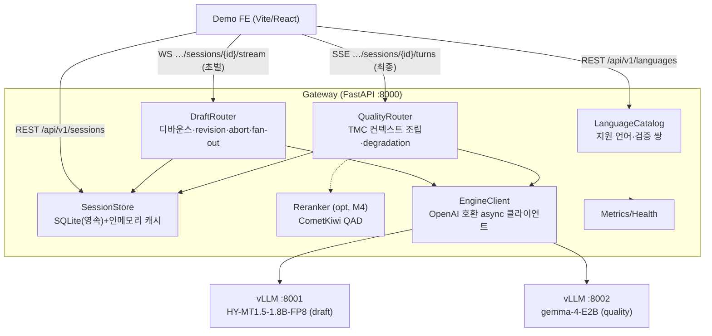
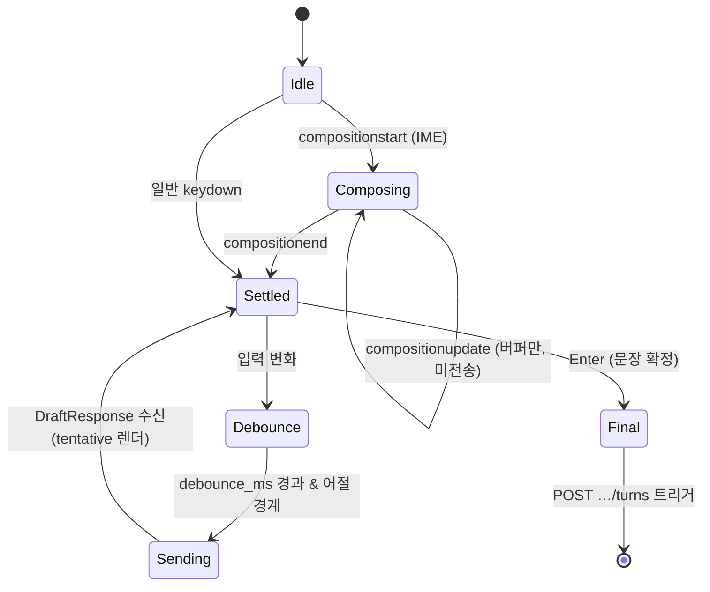
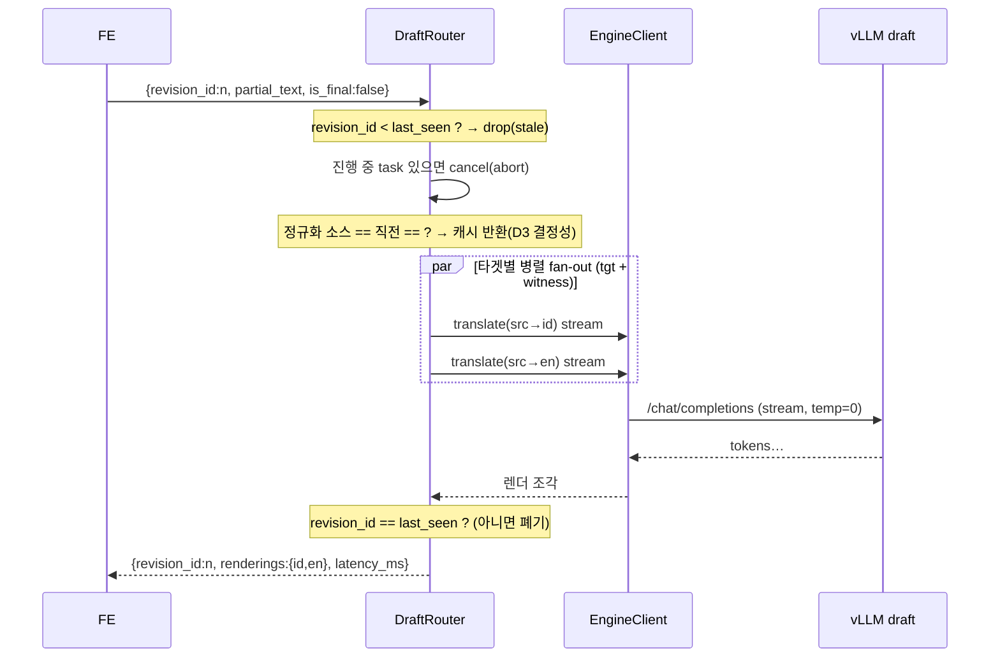
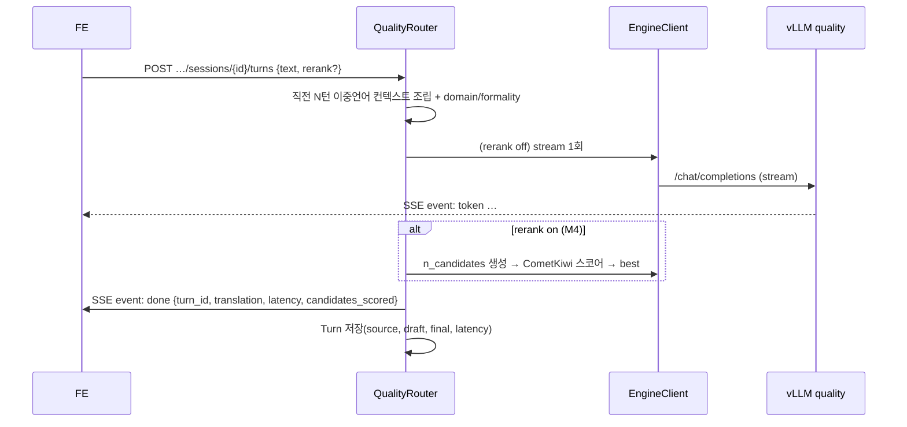

# 상세 설계서 (design)

이 문서는 M0 실측을 근거로 M1~M5 구현이 그대로 따라갈 **설계 명세**다. 개요는
[README](../README.md), 결정 근거는 [`decisions.md`](decisions.md), 서빙은
[`serving.md`](serving.md), 측정 원본은 [`../bench/RESULTS_M0.md`](../bench/RESULTS_M0.md).

> **설계 근거가 되는 실측 사실 (근거: decisions.md)**
> - 초벌 추론 TTFT p50 **12.5ms** < 디바운스 150~250ms → 레이턴시 예산의 대부분은
>   디바운스가 차지한다. 다중 타겟 병렬 번역을 추가할 여지가 있다. (D4)
> - ko(SOV)↔id(SVO) 접두어 생존율 **≈0%** → 목표문 접두어 확정(hold-k)으로는 확정할
>   접두어가 생기지 않는다. 전체 tentative 렌더 + revision 순서제어로 간다. (D3)
> - temp=0 greedy는 결정적(측정: 동일 프롬프트 5/5 동일) → 동일 소스는 동일 출력.
>   캐시·중복요청 제거 가능. (D3)
> - 초벌 6방향 평균 **COMET 88.59**, `ko↔id` 직접 87.8~87.9로 `ko↔en`(87.1)과 비슷.
>   en은 witness(증인) 언어로 쓸 수 있다. (D1·D2)

---

## 1. 컴포넌트 아키텍처

> 이 절은 컴포넌트의 **역할**을 개괄한다. 레이어·포트/어댑터·의존성 규칙 등
> 게이트웨이 내부 구조(OOP/클린 아키텍처)는 [`backend-architecture.md`](backend-architecture.md).



**책임 분리**
| 컴포넌트 | 책임 | 상태성 |
|---|---|---|
| `LanguageCatalog` | 지원 언어·언어명·검증된 쌍(+COMET) 제공 | 정적(설정) |
| `SessionStore` | 세션·턴 이력(SQLite 영속) + 결정성 캐시(인메모리 LRU) | SQLite + 인메모리 |
| `DraftRouter` | WS 수신 → 디바운스·revision 순서·이전요청 abort·다중 타겟 fan-out | 세션별 in-memory task |
| `QualityRouter` | 확정 문장 → TMC 컨텍스트 프롬프트 조립 → 스트리밍. 실패 시 degradation | stateless(세션 조회) |
| `EngineClient` | tier별 vLLM(OpenAI 호환)로 async 스트리밍/취소 | 커넥션 풀 |
| `Reranker` | (M4) 후보 N개 → CometKiwi 스코어 | optional |

---

## 2. 데이터 모델 (Pydantic v2)

```python
# 언어 (LanguageCatalog)
class LanguagePair(BaseModel):
    src: str; tgt: str
    validated: bool = False           # M0에서 측정했나
    comet: float | None = None        # FLORES-200 devtest COMET (검증된 쌍만)

class LanguageInfo(BaseModel):
    code: str                         # "ko"
    name_en: str                      # "Korean"
    name_native: str                  # "한국어"
    is_dialect: bool = False

# 세션 설정
class RerankConfig(BaseModel):
    enabled: bool = False
    n_candidates: int = Field(4, ge=2, le=8)
    metric: Literal["cometkiwi"] = "cometkiwi"

class StabilityConfig(BaseModel):
    debounce_ms: int = Field(200, ge=0, le=1000)
    commit_prefix: bool = False       # D3: 어순 유사 쌍에서만 켠다. 기본 off.

class SessionConfig(BaseModel):
    src_lang: str = "ko"              # 기본 쌍 ko⇄en. UI 선택기는 양방향(⇄로 스왑)
    tgt_lang: str = "en"              # primary target
    witness_langs: list[str] = ["en"] # D8: 증인 언어. tgt==witness면 자동 억제(중복)
    domain: str = "general"
    formality: Literal["polite", "casual", "neutral"] = "neutral"
    draft_model: str = "hy-mt1.5-1.8b"
    quality_model: str = "gemma-4-e2b"
    rerank: RerankConfig = RerankConfig()
    stability: StabilityConfig = StabilityConfig()

class Turn(BaseModel):
    turn_id: int
    source: str
    draft: dict[str, str]             # {lang: 최종 draft 번역}
    final: str | None                 # primary target quality 결과
    candidates_scored: int = 0
    latency_ms: dict[str, float]      # {"draft_ttft","draft_total","final_ttft","final_total"}
```

`SessionConfig` 검증: `src_lang`·`tgt_lang`·`witness_langs`는 모두
`LanguageCatalog`에 존재해야 하고 서로 달라야 한다(witness에 tgt/src 중복 시 제거).

**양방향 선택기(UI 요구):** 언어는 `[A] ⇄ [B]` 쌍으로 고르고 `⇄`로 방향을 스왑한다
(기본 `ko ⇄ en`). 스왑은 `src_lang`·`tgt_lang`을 뒤집어 세션에 반영. tgt가 en이면
witness(en)는 중복이라 열이 숨는다 — witness 열은 `ko⇄id`처럼 target을 못 읽는
조합에서 켜진다.

---

## 3. 지원 언어 & 언어 능력 노출

draft 모델(HY-MT1.5)이 지원하는 **33개 언어(+방언/소수민족 변형)**를 카탈로그로
제공한다. FE는 이 목록으로 언어 선택기와 "지원 언어" 패널을 그린다.

### `GET /api/v1/languages`
```jsonc
{
  "languages": [
    { "code": "ko", "name_en": "Korean",    "name_native": "한국어" },
    { "code": "id", "name_en": "Indonesian","name_native": "Bahasa Indonesia" },
    { "code": "en", "name_en": "English",   "name_native": "English" }
    // … zh, ja, vi, th, ms, tl, hi, fr, de, es, pt, it, ru, ar, tr, pl, cs, nl,
    //    km, my, fa, gu, ur, te, mr, he, bn, ta, uk, bo, kk, mn, ug
  ],
  "validated_pairs": [                      // M0에서 실측한 쌍만 COMET 노출
    { "src": "ko", "tgt": "id", "comet": 87.90 },
    { "src": "id", "tgt": "ko", "comet": 87.80 },
    { "src": "ko", "tgt": "en", "comet": 87.12 },
    { "src": "en", "tgt": "ko", "comet": 90.25 },
    { "src": "en", "tgt": "id", "comet": 90.67 },
    { "src": "id", "tgt": "en", "comet": 87.81 }
  ],
  "default_witness": "en"
}
```

- **미검증 쌍도 지원은 됨** — `validated`는 "M0에서 COMET을 쟀나"일 뿐. FE는 검증된
  쌍에 품질 배지(예: `COMET 87.9`)를, 그 외엔 "지원(미측정)"으로 표시.
- 카탈로그 소스는 draft 모델 카드의 언어 태그. 모델 교체 시 카탈로그만 갱신.

---

## 4. 초벌(draft) 파이프라인

### 4.1 클라이언트 입력 상태기 (FE)



- **IME 조합 제거:** `compositionupdate` 중인 자모(`안녕하세ㅇ`)는 전송하지 않고,
  `compositionend` 확정 문자열만 대상으로 한다. (한글 기준 우선 테스트 — README §2.1)
- **디바운스:** `debounce_ms`(기본 200) + 어절 경계 도달 시에만 revision 발사.
  추론이 12ms이므로 이 값이 flicker↔반응성의 실질 튜닝 손잡이. (D4)
- revision마다 `revision_id`를 단조 증가시켜 전송.

### 4.2 게이트웨이 초벌 처리 (BE)



**규칙 (실측 근거)**
1. **다중 타겟 fan-out (D8):** `[tgt_lang] + witness_langs`를 `asyncio.gather`로 병렬
   번역. 각 타겟은 프롬프트가 달라 KV 접두어는 분리되지만 타이핑 리비전 간
   접두어 재사용은 타겟별로 유효 → prefix caching 이득 유지.
2. **revision 순서 제어 (D3):** 응답이 역전 도착해도 `revision_id`가 현재 최신일
   때만 FE로 전달. 새 입력 도착 시 이전 task를 `cancel()` → vLLM은 클라이언트
   중단 시 생성을 abort하므로 GPU 낭비 없음.
3. **결정성 캐시 (D3):** 정규화 소스가 직전과 동일하면(백스페이스 후 복원 등)
   재요청 없이 캐시 렌더 반환.
4. **tentative 렌더 (D3):** 응답은 목표문 전체를 담고 FE는 **미확정 = 흐리게**
   렌더. `commit_prefix=false`가 기본. 어순 유사 쌍에서 켜면 응답에
   `committed_prefix_len`(타겟별)을 실어 보낸다.
5. **greedy·타이트:** `temperature=0`, `max_tokens` 소스 길이에 비례한 상한.

### 4.3 파라미터 (초벌)
`temperature=0`, prefix caching on, `max_tokens ≈ len(src_tokens)*2 + 16`.
세션 생성 시 **워밍업 요청 1회**로 콜드 TTFT(222ms) 제거. (D4)

---

## 5. 최종(quality) 파이프라인

### 5.1 컨텍스트 조립 (TMC)

Pombal et al. (TACL 2026)를 따른다. `is_final` 문장이 오면:

1. SessionStore에서 **직전 N턴의 이중언어(원문/번역) 쌍**을 가져온다(기본 N=5,
   토큰 예산 초과 시 오래된 턴부터 절단 — 요약은 후속 과제).
2. HY-MT 계열이면 **contextual template**(모델 카드의 중국어 지시형)에 컨텍스트를
   주입; Gemma 계열이면 system+few-shot 형태로 대화 맥락을 구성.
3. `domain`·`formality`를 지시에 반영(예: `formality=polite` → 존댓말/`Anda`).



### 5.2 Graceful degradation
quality tier 오류/타임아웃 시 해당 턴의 **primary target draft 결과를 최종으로
승격**하고 `degraded:true`로 done 이벤트를 보낸다. 데모가 멈추지 않는다.

### 5.3 witness 언어(최종)
비용 관리: **primary target만 quality tier**를 태우고 witness(en)는 draft 결과를
유지한다(witness는 개선 확인용이므로 quality tier까지 태우지 않음). 설정으로
witness도 quality로 올릴 수 있게 둔다.

### 5.4 Quality 모델 교체 후보
tier가 OpenAI 호환 뒤라 모델 교체 자유. 기준 `gemma-4-E2B`(D6) 외:
- `HY-MT1.5-7B(-FP8)` — 용어개입·문맥번역·서식유지 native, 단일 GPU FP8 배치 유리(D5).
- `MiLMMT-46-12B` — 46개 언어 범위에서 Tower-Plus-9B / Seed-X-7B / TranslateGemma 상회 보고.
- `gemma-4-26B-A4B` — MoE, 처리량 유리(GPU 여유 시).
- Gemma 4 MTP(Multi-Token Prediction) drafter 별도 배포 → 최종 tier TTFT 개선 검토.

---

## 6. 프로토콜 계약

> 네이밍·구조는 `fastapi-standards` 준수(`/api/v1`·복수 명사·계층). BE 구조는 [`backend-architecture.md`](backend-architecture.md).

### `POST /api/v1/sessions` → `201`
Body = `SessionConfig`. 응답 `{ "session_id": "..." }`. 생성 시 워밍업 수행.

### `GET /api/v1/languages` → `200`
§3 참조.

### `WS /api/v1/sessions/{session_id}/stream` — 초벌
세션은 경로에 있으므로 메시지 body에 `session_id`를 넣지 않는다.
```jsonc
// client → server
{ "revision_id":17, "partial_text":"내일 회의를 오후로", "is_final":false }

// server → client  (revision마다; 다중 렌더)
{
  "revision_id":17,
  "renderings": { "id":"Rapat besok ke sore", "en":"the meeting to the afternoon" },
  "committed_prefix_len": { "id":0, "en":0 },   // commit_prefix=false면 항상 0
  "latency_ms": { "ttft":12, "total":88 }
}
```
- `is_final:true`는 **초벌만 마무리**(진행 중 draft 정리)한다. 최종 번역은 자동
  트리거하지 않고 **FE가 `POST …/turns`로 명시 호출**한다(단일 경로 — 데모가
  프롬프트/후보를 노출하고 rerank 여부를 싣기 위함).
- **오류 처리:** stale revision은 조용히 drop. 업스트림 오류는
  `{ "revision_id":n, "error":"upstream_draft_error" }`.

### `POST /api/v1/sessions/{session_id}/turns` (SSE) — 최종
턴 생성이 곧 최종 번역 트리거. 응답은 `text/event-stream`.
```jsonc
// request
{ "text":"내일 회의를 오후로 옮겨도 될까요?", "rerank":true }
// events
event: token  data: {"delta":"Bisa"}
event: done   data: {"turn_id":5,"translation":"…","candidates_scored":4,
                     "degraded":false,"latency_ms":{"ttft":340,"total":1180}}
event: error  data: {"code":"upstream_quality_error","degraded_to_draft":true}
```

### `GET /api/v1/sessions/{session_id}/turns` → 턴별 원문/초벌/최종/레이턴시 이력
### `GET /health` → tier별 모델 로드 상태 · `GET /metrics` → §9

에러 응답은 `ErrorResponse { detail, error_code }` (fastapi-standards §3.2).

**에러 코드**: `session_not_found`(404) · `unsupported_language`(422) ·
`stale_revision`(silent) · `upstream_draft_error` · `upstream_quality_error`(→degrade) · `rate_limited`(429).

---

## 7. 동시성 / 취소 모델

- 초벌은 **세션당 하나의 활성 revision**만 유효. `DraftRouter`가 세션별
  `asyncio.Task`를 들고 있다가 새 revision 도착 시 `task.cancel()`.
- `EngineClient`는 `httpx.AsyncClient` 스트리밍. 취소 시 응답 스트림을 닫아 vLLM
  업스트림 생성을 중단(클라이언트 disconnect → vLLM abort).
- 타겟 fan-out은 하나의 revision task 안에서 `asyncio.gather(*targets)`; 일부 타겟
  실패해도 `return_exceptions=True`로 나머지는 렌더.
- 초벌·최종은 **반드시 별도 vLLM 인스턴스**(같은 엔진이면 초벌이 최종 뒤에 큐잉).
  GPU 배치는 [`serving.md`](serving.md).

---

## 8. 데모 UX 설계 (FE)

### 8.1 데모의 역할 — 무엇을 증명하는가

데모는 기능 나열이 아니라 **하나의 논증**이다. 주장별 난이도가 다르다:

| 주장 | 증명 장치 | 난이도 |
|---|---|---|
| ① 빠르다 | 레이턴시 오버레이(실측 TTFT 12ms) | 쉬움 |
| ② target을 몰라도 믿을 수 있다 | witness 언어(en) 동시 렌더 | 쉬움 |
| ③ 지원 범위가 넓다 | `/api/v1/languages` 33종 | 쉬움 |
| ④ **quality tier가 지연을 정당화한다** | **아래 8.3** | **어려움** |

④가 증명하기 가장 어렵다. 짧은 문장은 draft==final이라 quality tier의 효과가 드러나지
않는다(README §7이 지적한 함정). 데모 설계는 **④를 id를 모르는 사용자에게도 보이게**
하는 데 초점을 둔다.

### 8.2 화면 레이아웃
```
┌──────────────────────────────────────────────────────────────────┐
│ 모드 [시나리오 ▾ | 자유]  언어 [ ko ⇄ id ]  witness [en]  맥락 [on] │  ← 양방향 선택기
├───────────────┬────────────────────────────┬─────────────────────┤
│  입력 (ko)     │  PRIMARY  id               │  WITNESS  en        │
│  그거 오늘…    │  draft:(흐림) hal itu…      │  draft: handle that │  ← 초벌(맥락 없음)
│                │  final:      pengirimannya… │  final: the order   │  ← 최종(맥락)
├───────────────┴────────────────────────────┴─────────────────────┤
│ 레이턴시  draft 12ms/88ms · final 340/1180ms   | 콜드·degraded 표시 │
│ 대화 로그 (턴별 원문·초벌·최종)                                    │
└──────────────────────────────────────────────────────────────────┘
```

### 8.3 quality tier를 "보이게" 한다 (④)

- **witness로 개선을 읽는다:** witness-en을 primary(id)의 **draft와 final 양쪽**에
  렌더한다. id를 모르는 사용자가 영어로 *개선 자체*를 읽는다 — draft en
  `"handle that"` → final en `"process the order"`(`그거`가 맥락으로 복원). witness는
  "id가 맞나"를 넘어 **맥락 tier가 무슨 일을 하는지**를 비-화자에게 전달한다. (ko→en
  COMET 87.1로 en 렌더의 신뢰 근거가 있음 — D1)
- **counterfactual 토글(맥락 on/off):** 같은 문장을 맥락 없이/있이 나란히 →
  quality tier의 기여를 격리해 보여준다. (개선은 witness의 draft↔final 대비로 드러남 —
  LLM이 설명을 첨언하지 않는다. 시나리오가 대명사·격식·주어생략이 걸리도록 설계될 뿐.)
- **확정/미확정 시각 구분:** 미확정 초벌은 흐리게, `is_final` 후 최종은 선명하게.
  `commit_prefix` on일 때만 접두어 확정 스타일.

### 8.3.1 lay user에게 품질을 믿게 하는 장치 (연구 근거)

일반 사용자는 벤치마크 점수(COMET/QE 수치)를 해석하지 못하고, 유창한 출력이면
틀려도 믿는다(automation bias). 그래서 품질은 **숫자가 아니라 시각·상호작용**으로
보여준다. MT UX 연구에서 검증된 패턴을 조합한다:

| 장치 | 무엇을 보여주나 | 우선순위 |
|---|---|---|
| **witness 언어(en)** | 못 읽는 타겟 대신 읽을 수 있는 언어의 독립 forward 번역 | **주력** |
| **단어 QE 색상** | 모델이 불확실한 구간만 색(green/amber). 국소적·정직 | **주력** (CometKiwi 파생, M4) |
| **역번역(id→ko) 버튼** | 사용자 언어로 즉석 검증(on-demand) | **주력** (보조·경고 병기) |
| 구 정렬 hover | 소스 구 → 타겟·witness 대응 강조(커버리지) | 보조·**deferred** (D13, 지금 실측 불필요) |
| 숫자 COMET/QE | 전문가·디버그 패널에만 | lay엔 부적합 |

주력 3종은 별도 정렬 모델 없이 성립한다. 구 정렬 hover는 표준 zero-shot 정렬
(awesome-align/SimAlign)로 나중에 붙이는 후순위 장치다.

**정직성 원칙**: 다 초록으로 칠하지 않는다. 불확실성을 드러내는 편이 거짓 신뢰보다
낫다(§8.5와 일치). 근거·출처는 [`decisions.md`](decisions.md) D11.

### 8.4 두 가지 모드
- **시나리오 모드:** 준비된 다중 턴 대화(대명사 `그거`, 주어 생략, 존댓말)를 재생 →
  ④가 드러나도록 구성. 시나리오는 `bench/eval_set.py`의 대화 프로브 재사용.
- **자유 모드:** 사용자가 직접 타이핑 → 속도·IME·견고성·flicker 억제를 체감.
  (여기선 draft==final일 수 있음을 감수 — 속도 증명용.)
- (디버그) **역번역 검사:** primary(id)를 `id→en`으로 되번역해 witness와 비교 →
  id 출력을 직접 검증. 한 홉 추가라 옵션.

### 8.5 상태·한계 노출
숨기지 않고 표시한다: **콜드 첫 요청**(TTFT 상승), **degradation**(quality 실패 →
draft 승격 배지), **레이턴시 p95**. 실패 모드를 함께 보여준다.

### 8.6 지원 언어 노출
언어 선택기는 `/api/v1/languages`로 채우고 검증된 쌍엔 `COMET 87.9` 배지, 나머지엔
"지원(미측정)". "지원 언어 33종" 요약 뱃지 + 펼침 목록.

### 8.7 데모 시나리오 = 살아있는 명세
시나리오 대화는 **E2E 테스트 픽스처로 재사용**한다(Max 원칙 4). "이 대화에서 final은
`그거`를 이렇게 복원해야 한다"가 곧 회귀 테스트의 기대값이 된다 — 데모와 테스트가
같은 소스를 공유.

---

## 9. 관측성

`GET /metrics`(Prometheus 형식):
- tier별 **TTFT·total 히스토그램**(p50/p95/p99).
- **abort rate** — revision이 진행 중 요청을 취소한 비율(= flicker/낭비 신호, 튜닝 지표).
- **cache hit rate** — 결정성 캐시(D3) 적중률.
- **degradation count** — quality→draft 승격 횟수.
- 초벌 req/s, 타겟 fan-out 배수(witness 수).

`GET /health`: tier별 vLLM `/v1/models` 도달성 + 모델 로드 여부.

---

## 10. 배포 / 환경

- tier별 **별도 vLLM 인스턴스**, 단일 24GB 배치는 [`serving.md`](serving.md).
  quality 기준 모델 `gemma-4-E2B`(멀티모달 128K; `--max-model-len` 8K~32K 제한 권장).
- **venv 분리 (D7):** COMET(transformers v4)와 vLLM(v5)은 의존성 충돌 → 별도
  환경/컨테이너. reranker(CometKiwi, M4)는 quality 서버와 다른 컨테이너.
- 인프라는 Docker Compose로 코드화(게이트웨이·draft vLLM·quality vLLM·nginx).
  Redis는 데모에 불필요(D10) — 다중 노드 스케일 시 캐시 어댑터 교체로 추가.

---

## 11. 확정된 결정 · 남은 항목

**BE 하드닝 — 결정 완료 (D12):** 백프레셔(tier별 세마포어), 턴 멱등성(idempotency_key),
인증(데모 무인증·session_id capability), 취소→abort(vLLM disconnect 동작 의존),
컨텍스트 예산(최근 N턴 + 오래된 것부터 절단, 요약 미도입), 방향 스왑(컨텍스트 리셋).

**품질 근거 — 논문으로 갈음 (D6):** 맥락 tier 개선은 Pombal et al.(TACL 2026) 근거.
quality 모델은 고정하지 않으므로(교체 가능) 우리 자체 측정은 하지 않는다.

**모델 확정 시점에만 (지금 블로커 아님):**
- [ ] quality LLM을 하나로 픽스할 때 vLLM 서빙 여부·레이턴시·`--max-model-len` 확인.

**측정 가능해지면 (선택):**
- [ ] `commit_prefix`를 켤 만한 어순 유사 쌍(예: ko↔ja) 접두어 확정 실효.
- [ ] rerank(CometKiwi) context-aware 변형(M4).
- [ ] FLORES+ gated 재측정 parity(gate 승인 후).
- [ ] 구 정렬 hover 구현 시 정렬 방법·비용(D13 — deferred, 지금 실측 불필요).

**BE 미보강 (자체 점검에서 나온 갭)**
- [ ] **취소→vLLM abort 가정 검증** — httpx 스트림 close가 실제로 vLLM 생성을 멈추는지 M1에서 확인.
- [ ] **백프레셔/동시성 상한** — 다수 세션 시 draft 엔진 과부하 방지. 게이트웨이→vLLM 전역 동시 요청 캡·큐 바운드 미설계.
- [ ] **턴 생성 멱등성** — `POST …/turns` 재시도 시 중복 턴 방지(idempotency key) 미설계.
- [ ] **인증/인가** — 데모는 무인증 전제. 공개 배포 시 fastapi-standards §2(OAuth2/JWT) 필요.
- [ ] **방향 스왑 시 컨텍스트** — ko⇄en 스왑 후 이전 방향 턴 이력을 컨텍스트로 쓸지 새로 시작할지 정책 미정(데모는 스왑=새 대화 방향으로 단순화 가능).
