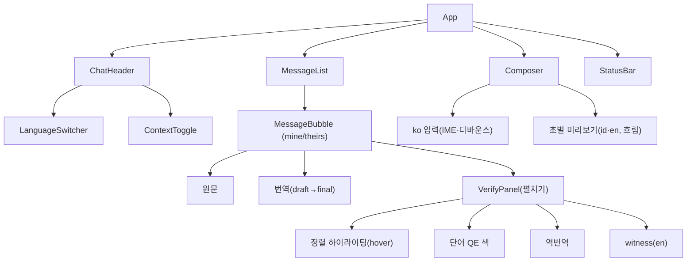

# 프론트엔드 아키텍처 (데모)

데모 웹앱(`web/`)의 구조를 정의한다. 화면 요구·사용자 흐름은
[`design.md`](design.md) §8 · [`user-scenario.md`](user-scenario.md), API는
[`design.md`](design.md) §6. 이 문서는 **FE를 어떤 구조·상태·통신으로 구현하는가**.

## 0. 스택

- **Vite + React + TypeScript.** 타입으로 API 계약(스키마)을 FE까지 이어 검증.
- 상태: 크로스 컴포넌트 세션/스트림 상태는 경량 스토어(예: Zustand), 입력 로컬
  상태는 React 훅. (데모 규모라 무거운 상태 라이브러리 불필요.)
- E2E: Playwright(`webapp-testing`) — 시나리오를 회귀 픽스처로.

## 1. 화면 구성 — 채팅 UI (기본)

번역이 **대화 맥락에 의존**하므로(TMC, design.md §5) UI의 기본은 채팅이다. 서로 다른
언어를 쓰는 두 사람의 대화를 중개(translation-mediated chat)하고, **각 메시지에 원문 +
번역을 함께** 보여준다 — 양측 번역이 대화 흐름에 그대로 드러난다.

```
┌────────────────────────────────────────────────────────────┐
│  민수  ·  한국어 ⇄ Bahasa Indonesia  ·  맥락 ●              │  ChatHeader
├────────────────────────────────────────────────────────────┤
│  ┌─ 상대 (id) ───────────────────────────┐                  │
│  │ Halo, headphone yang saya pesan…      │ ← 상대가 보낸 원문 │
│  │ 안녕하세요, 지난주에 주문한 헤드폰이…   │ ← 내가 읽는 ko 번역│
│  └───────────────────────────────────────┘                  │
│                       ┌───────────── 나 (ko) ─────────────┐  │
│              내가 친 ko │ 주문번호는 A-2231이에요            │  │
│            상대에게 id │ Nomor pesanan saya adalah A-2231   │  │
│            확인용 en  │ (My order number is A-2231)        │  │  witness
│                       └────────────────────────────────────┘  │
│                                              〔펼치기 ⌄〕      │  → 정렬·QE·역번역
├────────────────────────────────────────────────────────────┤
│  ┌ 그거 오늘 안에 처리해 주세요▏                    ┐ [전송] │  Composer
│  └ 초벌 id: Tolong proses pesanan…  en: handle that ┘(흐림) │  DraftPreview
└────────────────────────────────────────────────────────────┘
```

- **나(ko) 말풍선**(오른쪽): 내가 친 ko + 상대에게 나간 id + **확인용 en(witness)**.
- **상대(id) 말풍선**(왼쪽): 상대가 보낸 id + 내가 읽는 ko 번역.
- **컴포저**(하단): ko 입력 중 초벌(id·en) **실시간 미리보기(흐림)** → 전송 시 맥락 반영
  **최종 번역이 말풍선으로 확정**.
- **맥락**: 대화 전체가 컨텍스트 → 각 최종 번역이 직전 턴 반영(`그거→주문` 복원).
- **검증 도구는 말풍선 펼치기**로: 정렬 하이라이팅(hover)·단어 QE 색·역번역·witness.
  기본 화면은 깔끔하게, 의심되면 펼쳐 확인(design.md §8.3.1, D13). 구문 트리·LLM 첨언 안 씀.
- **양방향 선택기**(헤더): `[A] ⇄ [B]`(기본 `ko ⇄ en`), `⇄`로 방향 스왑. `tgt==en`이면
  witness 줄 숨김(중복). **같은 언어를 고르면** 거부하지 않고 UI가 자연스럽게 유도
  (전송 비활성 + "같은 언어예요" 힌트 — 서버는 거부 안 함, app §schemas).

## 2. 컴포넌트 트리



- **컨테이너/프리젠테이션 분리**: 통신·상태는 훅/스토어, 컴포넌트는 표시에 집중(SRP).
- **MessageBubble**이 원문+번역+검증을 캡슐화 — 양측(mine/theirs)이 같은 컴포넌트,
  `side`로 정렬·구성만 다르게.

## 3. 상태

```typescript
interface Message {
  id: string
  side: 'mine' | 'theirs'          // 내가 보냄(ko→id) / 상대가 보냄(id→ko)
  srcLang: string; tgtLang: string
  source: string                   // 원문
  final?: string                   // 확정 번역 (없으면 아직 처리 중)
  witness?: string                 // 확인용 en (mine이고 tgt≠en일 때)
  alignment?: AlignmentSpan[]      // 펼치기 시 사용 (turn done)
  confidence?: ConfidenceSpan[]    // 단어 QE
  latency?: LatencyInfo
}
interface ChatState {
  sessionId: string | null
  src: string; tgt: string; witness: string[]   // ko⇄en 기본
  context: boolean; rerank: boolean
  messages: Message[]              // 대화 = 컨텍스트
}
interface ComposerState {          // 입력 중(라이브)
  revisionId: number               // 단조 증가
  draft: Record<string, string>    // lang → 초벌 (id·en)
  latency?: LatencyInfo; cold: boolean
}
```

렌더 규칙:
- **초벌(컴포저)** — 최신 revision만 반영(`revision_id<현재`면 버림, flicker 방지 D3),
  흐리게 표시.
- **최종(말풍선)** — 전송 시 `final` 확정, 선명. `degraded`면 "간이 결과" 배지.
- 정렬·QE는 말풍선을 **펼칠 때만** 렌더(기본은 깔끔).

## 4. 통신 계층

세 클라이언트로 분리한다.

### 4.1 REST (`api/rest.ts`)
`POST /api/v1/sessions`, `GET /api/v1/languages`, `GET …/turns`. 타입은 백엔드
스키마와 1:1(생성 코드 또는 수기 타입).

### 4.2 WS 초벌 (`api/draftSocket.ts`)
`WS /api/v1/sessions/{id}/stream`.
- **연결 생명주기**: 세션 생성 후 open. 끊기면 같은 `sessionId`로 지수 백오프
  재연결(세션·턴은 서버 SQLite에 있어 생존, 진행 중 초벌만 유실).
- **송신**: 입력 상태기(§5)가 만든 revision을 `{revision_id, partial_text, is_final}`로.
- **수신**: `{revision_id, renderings, latency_ms}` → 최신 revision만 스토어 반영.
- 문장 확정 시 `is_final:true` 1회(초벌 정리용). 최종 번역은 §4.3으로 별도 요청.

### 4.3 SSE 최종 (`api/turnStream.ts`)
`POST /api/v1/sessions/{id}/turns` → `text/event-stream`.
- **주의**: POST라 브라우저 `EventSource`(GET 전용)를 못 쓴다. `fetch` +
  `response.body.getReader()`로 스트림을 읽어 `event: token|done|error`를 파싱한다.
- `token`마다 final 렌더 누적, `done`에 턴 확정·레이턴시, `error`에
  `degraded_to_draft` 처리(초벌을 최종 자리로 승격 표시).
- `AbortController`로 취소 가능(다음 턴 전 이전 스트림 정리).

## 5. 입력 상태기 (IME·디바운스·revision)

design.md §4.1의 상태기를 FE에서 구현한다. 훅 `useDraftInput`.

- **IME 조합 제거**: `compositionstart/update/end`. `compositionupdate` 중 자모
  (`안녕하세ㅇ`)는 전송 금지, `compositionend` 확정 문자열만.
- **디바운스**: `debounce_ms`(기본 200) + 어절 경계에서만 발사.
- **revision_id 단조 증가**: 발사마다 +1. 백스페이스로 소스가 직전과 같아지면
  재전송 생략(서버 결정성 캐시와 별개로 클라도 중복 억제).
- **전송(Enter/버튼)**: 메시지 확정 → WS `is_final` + `POST …/turns` → 최종 번역이
  말풍선으로 확정되고 컴포저 초벌 미리보기는 비워진다.

## 6. 언어 선택기 (양방향)

- `GET /api/v1/languages`로 목록·검증쌍을 채운다. 검증쌍엔 `COMET 87.9` 배지,
  그 외 "지원(미측정)".
- `[A] ⇄ [B]` 쌍 선택 + `⇄` 스왑(= `src`↔`tgt` 교환). 기본 `ko ⇄ en`.
- 스왑/언어 변경 시: 진행 중 초벌 취소, 스토어 렌더 초기화. (방향 스왑 시 컨텍스트
  정책은 design.md §11 open — 데모는 스왑=새 대화 방향으로 단순화.)

## 7. 데모 모드

- **시나리오 모드**: `src/scenarios/*.ts`의 준비된 **양측 대화를 채팅으로 재생**(상대
  메시지 자동 도착 + 내 답장). 대명사 `그거`·주어 생략·존댓말이 걸려 있어 맥락 tier
  개선이 witness에 드러남. **E2E 픽스처와 동일 소스**(살아있는 명세, design.md §8.7).
- **자유 모드**: 직접 타이핑(내 쪽) → 속도·IME·flicker 억제 체감. 상대 쪽은 프리셋
  응답 또는 수동 입력.

## 8. 프로젝트 구조 (web/)

```
web/
├── index.html
├── src/
│   ├── main.tsx, App.tsx
│   ├── api/            # rest.ts · draftSocket.ts · turnStream.ts
│   ├── store/          # chat·composer 스토어
│   ├── hooks/          # useDraftInput(IME·디바운스) · useDraftSocket · useTurnStream
│   ├── components/     # ChatHeader · LanguageSwitcher · MessageList · MessageBubble · VerifyPanel(Alignment/QE/BackTrans) · Composer · DraftPreview · StatusBar
│   ├── scenarios/      # 준비된 대화(채팅 replay) = E2E 픽스처
│   └── types/          # API 스키마 타입
└── tests/e2e/          # Playwright 시나리오
```

의존성은 **pnpm/npm으로 최신 버전 설치**(수기 버전 고정 금지) — `pnpm create vite`
스캐폴딩 후 필요한 것만 추가.

## 9. 미해결 / 고려

- [ ] WS 재연결 중 사용자가 계속 타이핑할 때의 큐잉·순서 보장 세부.
- [ ] 시나리오 자동재생 속도·수동 스텝 UX.
- [ ] QE 점수(CometKiwi, M4) 표시 위치·해석(0~100 배지).
- [ ] 접근성(색약 대비: tentative/final 구분을 색만으로 하지 않기)·모바일 레이아웃.
