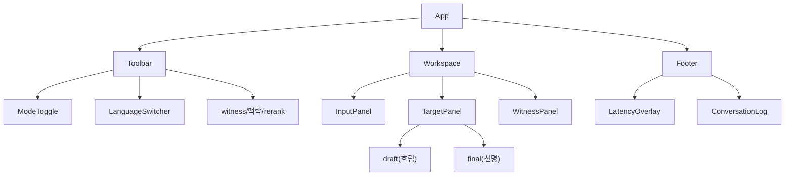

# 프론트엔드 아키텍처 (데모)

데모 웹앱(`web/`)의 구조를 정의한다. 화면 요구·사용자 흐름은
[`design.md`](design.md) §8 · [`user-scenario.md`](user-scenario.md), API는
[`design.md`](design.md) §6. 이 문서는 **FE를 어떤 구조·상태·통신으로 구현하는가**.

## 0. 스택

- **Vite + React + TypeScript.** 타입으로 API 계약(스키마)을 FE까지 이어 검증.
- 상태: 크로스 컴포넌트 세션/스트림 상태는 경량 스토어(예: Zustand), 입력 로컬
  상태는 React 훅. (데모 규모라 무거운 상태 라이브러리 불필요.)
- E2E: Playwright(`webapp-testing`) — 시나리오를 회귀 픽스처로.

## 1. 화면 구성

```
┌───────────────────────────────────────────────────────────────┐
│ 모드 [시나리오 ▾ | 자유]   언어 [ ko ⇄ en ]   witness[en] 맥락[on]│  LanguageSwitcher
├──────────────┬────────────────────────┬───────────────────────┤
│ InputPanel   │ TargetPanel (primary)  │ WitnessPanel (opt)    │
│ (ko 입력)     │ draft(흐림)/final(선명) │ draft/final (en)      │
├──────────────┴────────────────────────┴───────────────────────┤
│ LatencyOverlay  초벌 12ms · 최종 1.2s        (콜드·degraded 배지)│
│ ConversationLog (턴별 원문·초벌·최종)                           │
└───────────────────────────────────────────────────────────────┘
```

- **언어 선택기는 양방향** `[A] ⇄ [B]`(기본 `ko ⇄ en`). `⇄`로 방향 스왑.
- **WitnessPanel은 조건부**: `tgt == 'en'`이면 숨김(중복), `ko⇄id`처럼 target을 못
  읽는 조합에서 표시.
- **품질을 lay user에게 보이는 장치**(연구 근거, design.md §8.3.1): 구 정렬 hover
  (소스↔타겟↔witness 대응 강조) · witness 언어 · 단어 QE 색상(불확실 구간) · 역번역
  검증 버튼. 숫자 점수는 디버그 패널에만. 구문 트리·LLM 첨언은 안 씀(트리는 어순
  비대응으로 무의미 — decisions.md).

## 2. 컴포넌트 트리



- **컨테이너/프리젠테이션 분리**: 통신·상태는 훅/스토어, 컴포넌트는 표시에 집중(SRP).

## 3. 상태

```typescript
interface SessionState {
  sessionId: string | null
  src: string; tgt: string; witness: string[]   // ko⇄en 기본
  mode: 'scenario' | 'free'
  context: boolean; rerank: boolean
}
interface StreamState {
  revisionId: number                    // 단조 증가
  renderings: Record<string, {          // lang → {draft, final, committed}
    draft: string; final?: string; committedPrefixLen: number
  }>
  latency: { draftTtft?: number; draftTotal?: number; finalTtft?: number; finalTotal?: number }
  degraded: boolean; cold: boolean
}
```

렌더 규칙:
- **최신 revision만 반영** — 응답의 `revision_id < 현재`면 버린다(flicker 방지, D3).
- **tentative vs 확정** — draft는 흐리게, `final` 도착 후 선명. `committedPrefixLen>0`
  (어순 유사 쌍)일 때만 접두어 확정 스타일.

## 4. 통신 계층

세 클라이언트로 분리한다.

### 4.1 REST (`api/rest.ts`)
`POST /api/v1/sessions`, `GET /api/v1/languages`, `GET …/turns`. 타입은 백엔드
스키마와 1:1(생성 코드 또는 수기 타입).

### 4.2 WS 초벌 (`api/draftSocket.ts`)
`WS /api/v1/sessions/{id}/stream`.
- **연결 생명주기**: 세션 생성 후 open. 끊기면 같은 `sessionId`로 지수 백오프
  재연결(세션·턴은 서버 SQLite에 있어 생존, 진행 중 초벌만 유실).
- **송신**: 입력 상태기(§5)가 만든 revision을 `{revision_id, partial_text, is_final}`로.
- **수신**: `{revision_id, renderings, latency_ms}` → 최신 revision만 스토어 반영.
- 문장 확정 시 `is_final:true` 1회(초벌 정리용). 최종 번역은 §4.3으로 별도 요청.

### 4.3 SSE 최종 (`api/turnStream.ts`)
`POST /api/v1/sessions/{id}/turns` → `text/event-stream`.
- **주의**: POST라 브라우저 `EventSource`(GET 전용)를 못 쓴다. `fetch` +
  `response.body.getReader()`로 스트림을 읽어 `event: token|done|error`를 파싱한다.
- `token`마다 final 렌더 누적, `done`에 턴 확정·레이턴시, `error`에
  `degraded_to_draft` 처리(초벌을 최종 자리로 승격 표시).
- `AbortController`로 취소 가능(다음 턴 전 이전 스트림 정리).

## 5. 입력 상태기 (IME·디바운스·revision)

design.md §4.1의 상태기를 FE에서 구현한다. 훅 `useDraftInput`.

- **IME 조합 제거**: `compositionstart/update/end`. `compositionupdate` 중 자모
  (`안녕하세ㅇ`)는 전송 금지, `compositionend` 확정 문자열만.
- **디바운스**: `debounce_ms`(기본 200) + 어절 경계에서만 발사.
- **revision_id 단조 증가**: 발사마다 +1. 백스페이스로 소스가 직전과 같아지면
  재전송 생략(서버 결정성 캐시와 별개로 클라도 중복 억제).
- **Enter**: 문장 확정 → WS `is_final` + `POST …/turns` 트리거.

## 6. 언어 선택기 (양방향)

- `GET /api/v1/languages`로 목록·검증쌍을 채운다. 검증쌍엔 `COMET 87.9` 배지,
  그 외 "지원(미측정)".
- `[A] ⇄ [B]` 쌍 선택 + `⇄` 스왑(= `src`↔`tgt` 교환). 기본 `ko ⇄ en`.
- 스왑/언어 변경 시: 진행 중 초벌 취소, 스토어 렌더 초기화. (방향 스왑 시 컨텍스트
  정책은 design.md §11 open — 데모는 스왑=새 대화 방향으로 단순화.)

## 7. 데모 모드

- **시나리오 모드**: `src/scenarios/*.ts`의 준비된 다중 턴 대화를 재생(대명사 `그거`,
  주어 생략, 존댓말) → quality tier 개선이 witness에 드러남. 이 시나리오는 **E2E
  픽스처와 동일 소스**(살아있는 명세, design.md §8.7).
- **자유 모드**: 직접 타이핑 → 속도·IME·flicker 억제 체감.

## 8. 프로젝트 구조 (web/)

```
web/
├── index.html
├── src/
│   ├── main.tsx, App.tsx
│   ├── api/            # rest.ts · draftSocket.ts · turnStream.ts
│   ├── store/          # session·stream 스토어
│   ├── hooks/          # useDraftInput(IME·디바운스) · useDraftSocket · useTurnStream
│   ├── components/     # Toolbar · LanguageSwitcher · InputPanel · TargetPanel · WitnessPanel · LatencyOverlay · ConversationLog
│   ├── scenarios/      # 준비된 대화 = E2E 픽스처
│   └── types/          # API 스키마 타입
└── tests/e2e/          # Playwright 시나리오
```

의존성은 **pnpm/npm으로 최신 버전 설치**(수기 버전 고정 금지) — `pnpm create vite`
스캐폴딩 후 필요한 것만 추가.

## 9. 미해결 / 고려

- [ ] WS 재연결 중 사용자가 계속 타이핑할 때의 큐잉·순서 보장 세부.
- [ ] 시나리오 자동재생 속도·수동 스텝 UX.
- [ ] QE 점수(CometKiwi, M4) 표시 위치·해석(0~100 배지).
- [ ] 접근성(색약 대비: tentative/final 구분을 색만으로 하지 않기)·모바일 레이아웃.
