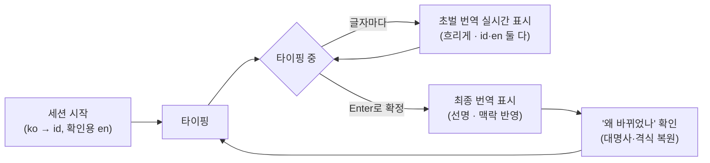
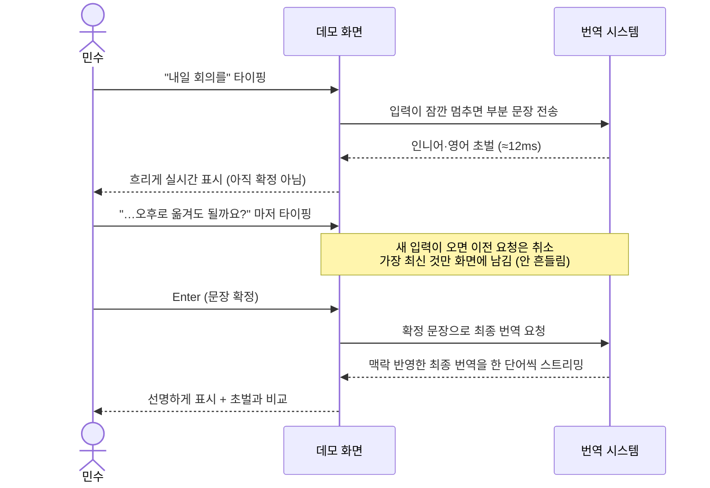
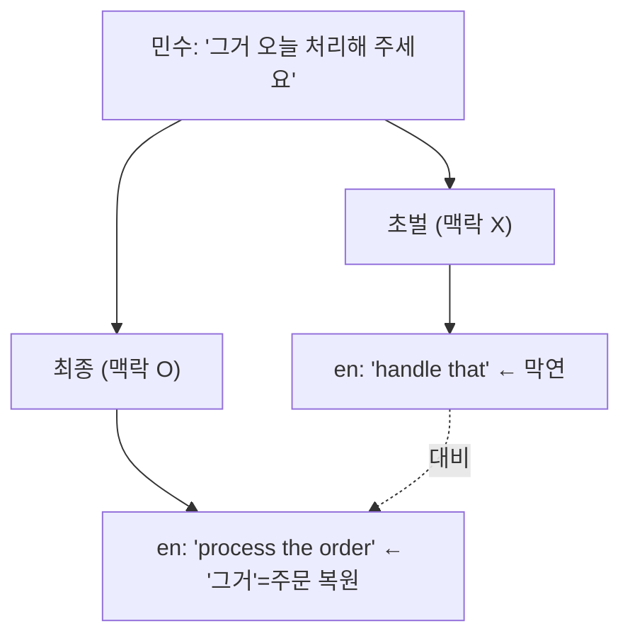

# 사용자 시나리오 (데모 걸어보기)

데모를 **사용자 눈높이**에서 따라간다. 내부 컴포넌트가 아니라 "무엇을 하고 무엇이
보이는가"로 설명한다. 화면·기능 근거는 [`design.md`](design.md) §8.

## 등장 상황

- **민수** — 한국어만 쓰는 고객지원 담당자. 인도네시아어(id)를 **모른다.**
- **상대** — 인도네시아 고객. 민수의 한국어 답장이 인도네시아어로 번역돼 전달된다.
- 민수의 걱정: "내가 못 읽는 언어로 나가는데, 번역이 제대로 되는 걸 어떻게 믿지?"
  → 데모는 **영어(en) witness**를 나란히 보여줘 이 걱정을 푼다.

## 화면 (민수가 보는 것)

```
┌──────────────┬────────────────────────┬────────────────────┐
│  입력 (한국어) │  상대에게 갈 번역 (id)   │  확인용 영어 (en)   │
│              │  draft: (흐림, 실시간)  │  draft: (흐림)      │
│              │  final: (선명, 확정 후)  │  final: (선명)      │
├──────────────┴────────────────────────┴────────────────────┤
│  속도  초벌 12ms · 최종 1.2s     |  "왜 바뀌었나" 설명        │
└─────────────────────────────────────────────────────────────┘
```

- **가운데(id)** 가 실제로 상대에게 가는 번역. 민수는 못 읽는다.
- **오른쪽(en)** 은 민수가 읽고 "제대로 됐다"를 확인하는 **증인**. 상대에겐 안 나간다.

## 전체 여정 한눈에



## 한 문장을 보내는 동안 (사용자 ↔ 화면 ↔ 시스템)



**민수가 느끼는 것**
- 타이핑하는 동안 번역이 **바로바로** 뜬다(속도 숫자로 확인). 확정 전이라 흐리게.
- 글자를 더 쳐도 화면이 요동치지 않는다(최신 것만 남김).
- Enter를 누르면 더 다듬어진 최종본이 선명하게 뜬다.

## 진짜 보여주려는 것 — 맥락이 번역을 고친다

짧은 문장은 초벌·최종이 같아서 "굳이 최종이 왜 필요해?" 싶다. 그래서 데모는
**대명사가 걸린 다중 턴 대화**를 준비한다. 민수가 이어서 친다:

| 턴 | 민수 입력(ko) | 상대에게(id) | 민수가 읽는 확인용(en) |
|---|---|---|---|
| 1 | 지난주 주문한 헤드폰이 아직 안 왔어요 | (번역) | The headphones I ordered last week haven't arrived |
| 2 | 주문번호는 A-2231이에요 | (번역) | The order number is A-2231 |
| 3 | **그거** 오늘 안에 처리해 주세요 | (번역) | 초벌: *"handle **that**"* → 최종: *"process **the order**"* |

3번의 "그거"는 앞 맥락(주문/배송)을 알아야 무엇인지 안다.
- **초벌**(맥락 없음): en으로 `"handle that"` — 막연하다.
- **최종**(직전 턴 맥락 반영): en으로 `"process the order"` — **그거 = 그 주문**으로 복원.

민수는 인도네시아어를 몰라도, **영어(witness)에서 번역이 좋아지는 걸 직접 읽는다.**
이게 "최종 tier가 지연을 감수할 값을 한다"는 데모의 핵심 증거다.



## 이럴 땐 (예외 상황도 보여준다)

- **처음 한 번은 살짝 느림** — 모델을 데우는 첫 요청만 반응이 늦다. 데모는 이를
  숨기지 않고 표시하며 세션 시작 시 미리 한 번 데워 이후엔 빠르다.
- **최종 번역이 잠깐 실패** — 이럴 땐 초벌 결과를 최종 자리에 올리고 "간이 결과"임을
  배지로 알린다. 화면이 멈추지 않는다.

## 어떤 언어까지 되나

언어 선택기에서 지원 언어(33종)를 고른다. 실측으로 품질을 확인한 조합
(ko↔id·ko↔en·en↔id 등)에는 `COMET 87.9` 같은 품질 배지가 붙고 나머지는
"지원(미측정)"으로 표시된다. 세부는 [`design.md`](design.md) §3·§8.
